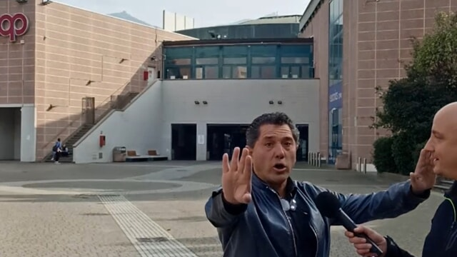
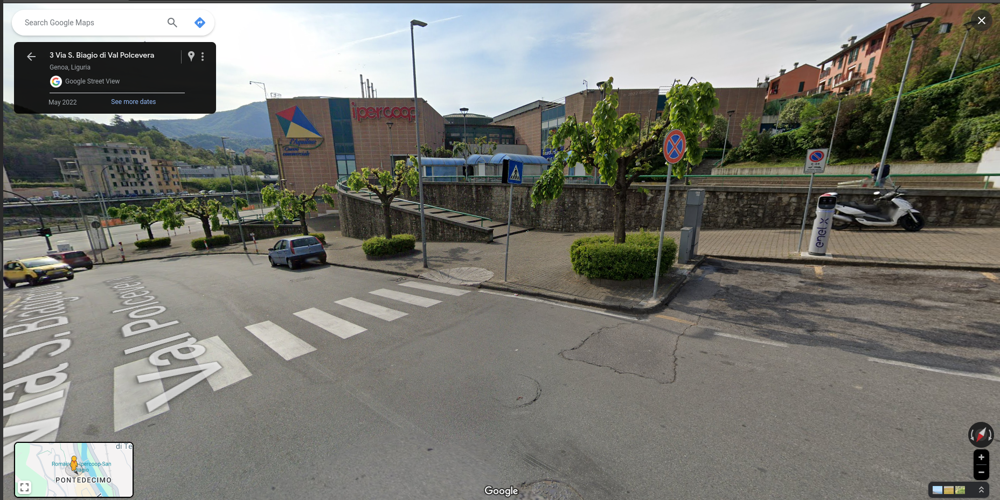

# Telecamere?
## Writeup Author - h1tok1r11

---

### Task

I cant find it.
Flag format: hctf{street_name}

---

### Solution

If we google **Roberto intervista** we'll see this(it will help us later):


And if we look at the images, we'll see this picture:


Then if we use Google function **Search by image** on the logo in the upper left corner of previous image, we'll see similsar logo:


This is one of the largest supermarket chains in Italy.
Next step is to find where it is located. So thanks to the Facebook post from the first screen, we can try to find **coops** in **Genova**.
Going through all the options we come across the **coop** we need:


---

### Flag

```
hctf{???}