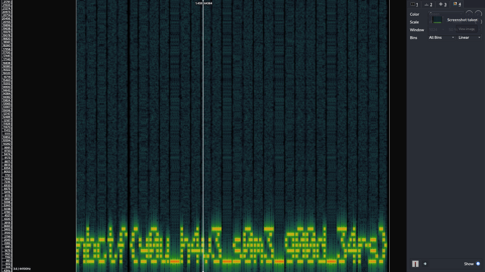

# Misc - do you hear that? (241 points)
## Writeup Author: GameIsOn

---

### Task

I'm not sure why, but when I look at this image I can hear some sort of faint sound. Do you hear it too?

Attached files:
```
-- help.png
```

**help.png:**


---

### Solution

Trying the basic commands:

```
$ binwalk help.png 

DECIMAL       HEXADECIMAL     DESCRIPTION
--------------------------------------------------------------------------------
0             0x0             PNG image, 639 x 639, 8-bit/color RGBA, non-interlaced
41            0x29            Zlib compressed data, compressed
35334         0x8A06          TIFF image data, big-endian, offset of first image directory: 8
```
```
$ exiftool help.png
ExifTool Version Number         : 12.57
File Name                       : help.png
Directory                       : .
File Size                       : 353 kB
File Modification Date/Time     : 2023:12:02 13:29:27+03:00
File Access Date/Time           : 2023:12:03 21:26:03+03:00
File Inode Change Date/Time     : 2023:12:02 13:29:27+03:00
File Permissions                : -rw-r--r--
File Type                       : PNG
File Type Extension             : png
MIME Type                       : image/png
Image Width                     : 639
Image Height                    : 639
Bit Depth                       : 8
Color Type                      : RGB with Alpha
Compression                     : Deflate/Inflate
Filter                          : Adaptive
Interlace                       : Noninterlaced
Warning                         : [minor] Text/EXIF chunk(s) found after PNG IDAT (may be ignored by some readers)
Exif Byte Order                 : Big-endian (Motorola, MM)
Image Size                      : 639x639
Megapixels                      : 0.408
```
Nothing interesting so far...

```
$ pngcheck help.png
help.png  additional data after IEND chunk
ERROR: help.png
```

Oh? Well, that's interesting. Let's take a closer look.

```
$ zsteg help.png    
[?] 317564 bytes of extra data after image end (IEND), offset = 0x8a24
extradata:0         .. file: RIFF (little-endian) data, WAVE audio, Microsoft PCM, 16 bit, mono 44100 Hz
    00000000: 52 49 46 46 74 d8 04 00  57 41 56 45 66 6d 74 20  |RIFFt...WAVEfmt |
    00000010: 10 00 00 00 01 00 01 00  44 ac 00 00 88 58 01 00  |........D....X..|
    00000020: 02 00 10 00 64 61 74 61  50 d8 04 00 00 00 00 00  |....dataP.......|
    00000030: 01 00 03 00 05 00 08 00  0a 00 0b 00 0b 00 09 00  |................|
    00000040: 06 00 02 00 fe ff f9 ff  f6 ff f4 ff f5 ff f7 ff  |................|
    00000050: fb ff 00 00 04 00 08 00  09 00 06 00 00 00 f7 ff  |................|
    00000060: ec ff e0 ff d5 ff cd ff  c8 ff c8 ff ce ff d7 ff  |................|
    00000070: e3 ff f0 ff fb ff 03 00  05 00 01 00 f7 ff e9 ff  |................|
    00000080: d8 ff c9 ff be ff b9 ff  bd ff cb ff e0 ff fd ff  |................|
    00000090: 1b 00 39 00 51 00 60 00  64 00 5c 00 4b 00 32 00  |..9.Q.`.d.\.K.2.|
    000000a0: 18 00 02 00 f6 ff f7 ff  08 00 29 00 57 00 8d 00  |..........).W...|
    000000b0: c3 00 f1 00 0e 01 16 01  05 01 db 00 9e 00 55 00  |..............U.|
    000000c0: 0c 00 ce ff a6 ff 9d ff  b7 ff f2 ff 46 00 a4 00  |............F...|
    000000d0: fb 00 36 01 40 01 09 01  88 00 ba ff aa fe 6a fd  |..6.@.........j.|
    000000e0: 17 fc d3 fa c5 f9 10 f9  d2 f8 21 f9 01 fa 6d fb  |..........!...m.|
    000000f0: 4c fd 7b ff cb 01 09 04  04 06 8f 07 89 08 de 08  |L.{.............|
[!] possible image block size is 639x5, downscaling may be necessary
```
Now the connection is clear: there is an audio file written under the chunks of the PNG file.
Let's get it!
```bash
tail -c +0x8a25 help.png > help.wav
```
Bingo!

[audio file](./assets/help.wav)

There is some kind of spectrogram-noise. 
**Let's check it with Sonic Visualiser - Spectrogram Layer:**



---

### Flag

```
nbctf{y0u_h4v3_s0m3_g00d_34rs}
```