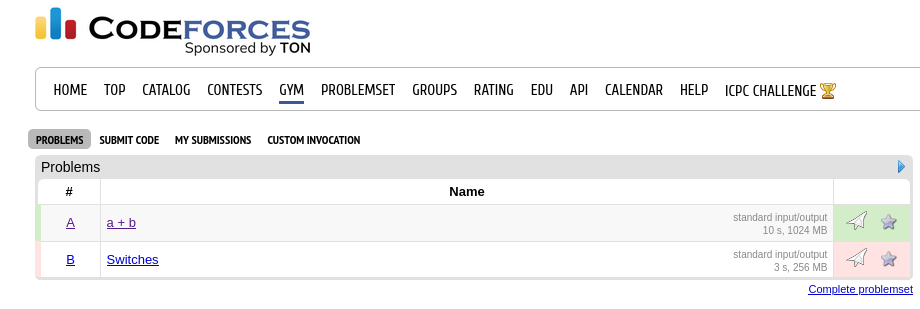
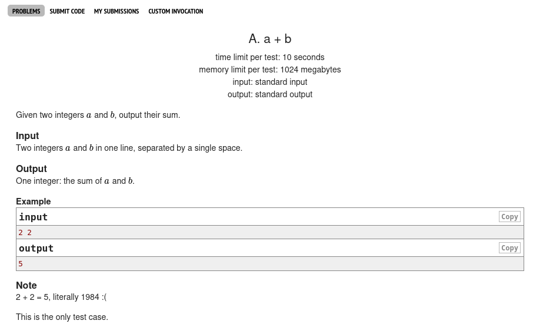
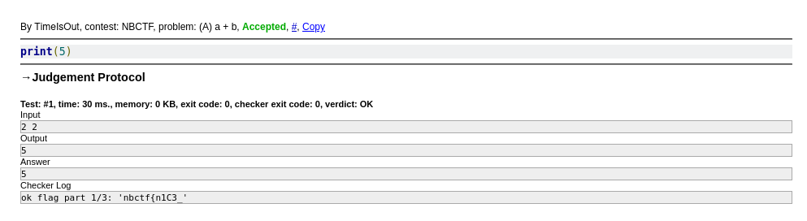
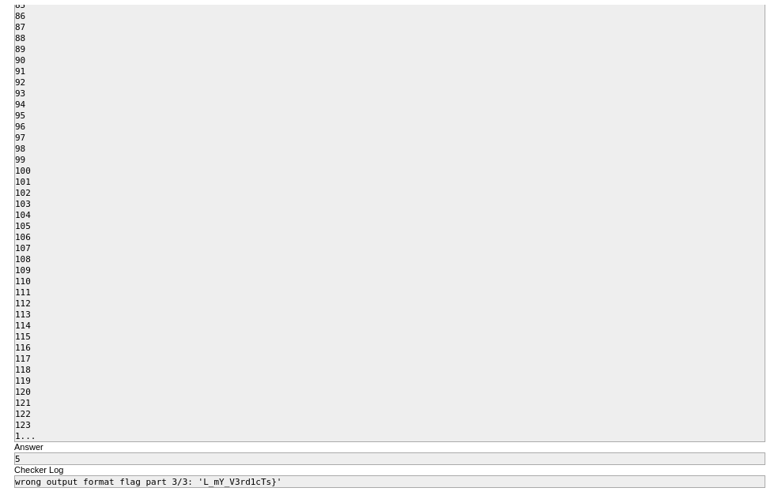

# Misc - not accepted (365 points)
## Writeup Author: GameIsOn

---

### Task

I can't seem to pass this problem... can you help me? https://codeforces.com/contestInvitation/9cf6e56adf19ecb8e5dd7af8a9c5bf5610c8e46e

--- 

### Solution

#### Flag 1/3

There is a contest named 'NBCTF' on the Codeforces website. The first task on it is reffered to our problem.



The idea of the task is following text:



Only test case? Cool. Let's write some code then :)

```python
print(5)
```

I don't even need to get the inputs, if this is the only check we have in the test cases.



Bingo! There is the first part of the flag:
```
ok flag part 1/3: 'nbctf{n1C3_'
```

#### Flag 2/3

Let's try to get an incorrect answer.

```python
print(4) # Right answer, actually.
```


And there is the second part:
```
wrong answer flag part 2/3: 'y0U_90t_4l'
```

#### Flag 3/3

Maybe it will show us the last part with the Wrong output format?

```python
for i in range(10000):
    print(i)
```



Yup, that'll do.

```
wrong output format flag part 3/3: 'L_mY_V3rd1cTs}'
```

---

### Flag

```
nbctf{n1C3_y0U_90t_4lL_mY_V3rd1cTs}
```