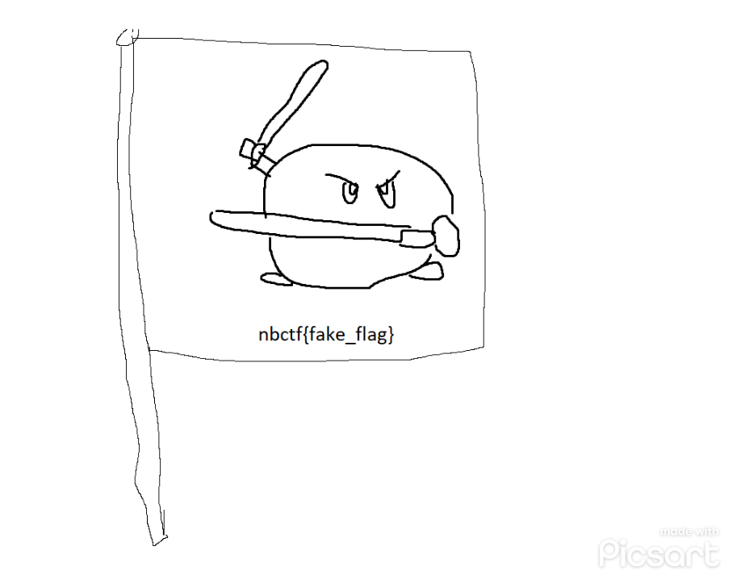
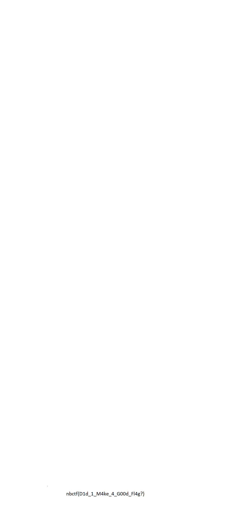

# OSINT - Linkedout 1 (352 points)
## Writeup Author: n0vac
---

### Task

I’ve just finished setting up Newport blakes LinkedIn! I hope I didn't give away too much personal information in my profile. Someone might even be able to find a flag hidden in there.
 
---
### Solution

I saw "Newport blakes Linkedin", so therefore I knew I had to look for an account on LinkedIn.

I then found an account named "Newport (CTF) Blake". It looks like what I am looking for.
**[The account](https://www.linkedin.com/in/newport-blake-ctf6e626374667b4431645f7930755f537030745f31743f7d/)**

I then began analyzing the page to see where the flag could be and I saw an "imgur" link in the Projects tab of the profile.
**[Imgur link 1](https://imgur.com/a/pGwm2Mg)**
I went to the link and well... 


...that wasn't the flag I was looking for.
But the title of the post seemed a bit odd, it looked like HEX to me.
I put the title of the post through CyberChef with the recipe "From Hex" and I got another "imgur" link.
**[Imgur link 2](https://imgur.com/a/sOti4RH)**
The image was blank, but it was tall. So I scrolled down, and the flag was at the bottom of the image.



---
### Flag

```
nbctf{D1d_1_M4ke_4_G00d_Fl4g?}
```