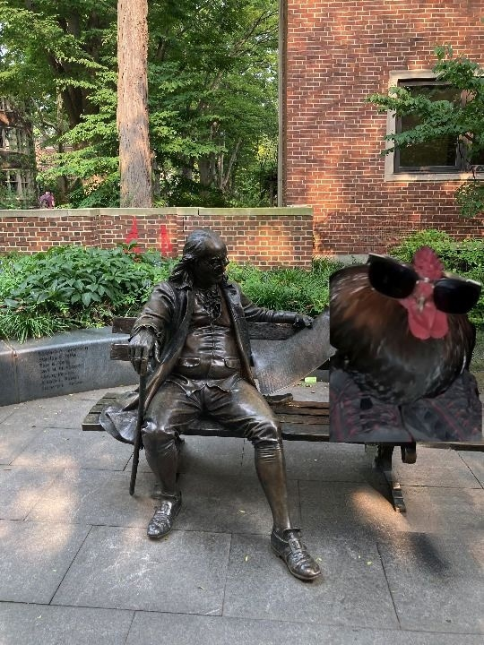

# OSINT - Linkedout 2 (421 points)
## Writeup Author: n0vac
---

### Task

Dang I can't believe I'm going to be a senior soon. I love writing about my experiences touring various college campuses. Unfortunately on my most recent trip, I seem to have lost my flag somewhere. Can you help me find it?
hint: flag format is nbctf{xxxx.xxxx.xxxx}. (What three words would give that location?)
hint 2: to avoid confusion, please use the address of the closest intersection near the actual location

---
### Solution

The second challenge in the Linkedout series! As always, it was related to the first Linkedout challenge, the profile we found there.

So I went to the profile again and the latest post was as such:
```
I love vacationing! Unfortunately, I seem to have left my flag somewhere. Can you help me find it?
```


What I saw in the image was something that looked like a statue, but I didn't know the name of it.
So then, I went to Yandex Images and did a reverse image search and saw that the statue was named

```
Ben on the Bench
```

Well, there we go! I went to Google Maps and saw where that was. It said "the closest intersection", and the closest one was a few steps away from the statue.
But it said 3 words, so I googled "how do i describe a location with 3 words" and I got "https://what3words.com"

I went there and typed "Ben on the Bench" (as the location for it was basically right on the intersection) and clicked on the first result.

And the 3 words I got were... "living.successes.dine"!

I put that inbetween "nbctf{" and "}" and submitted it. And it was correct!

---
### Flag

```
nbctf{living.successes.dine}
```